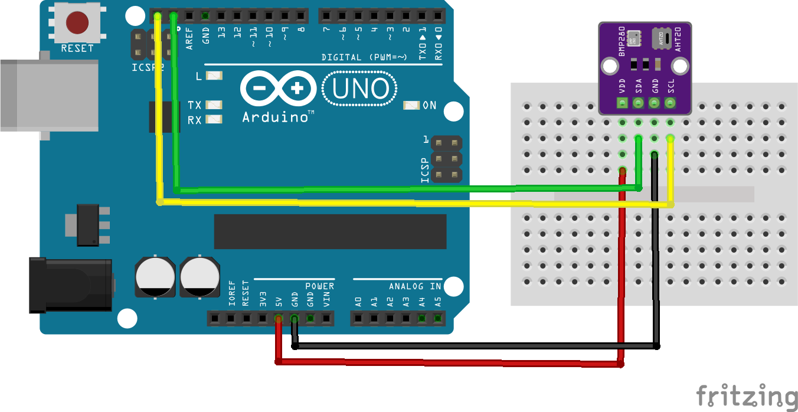
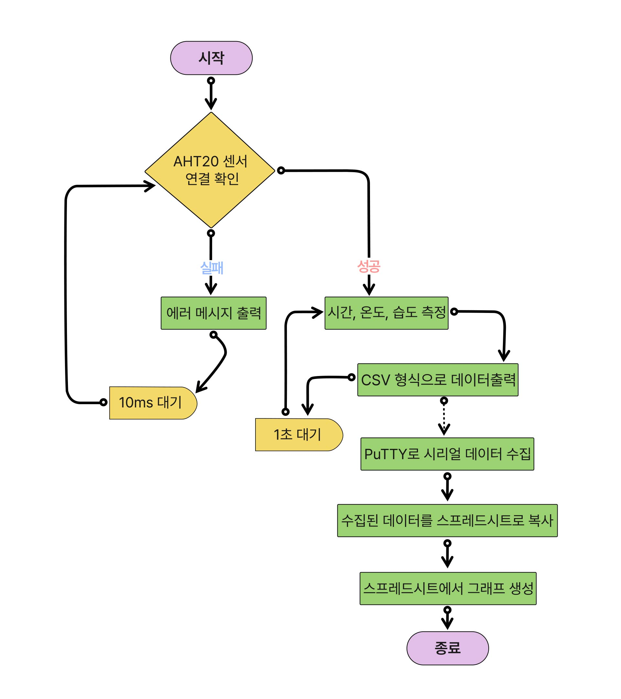

# 🎬 공학도서관 오리지널 컨텐츠

# 📊 온습도 측정기 만들기

## 📝 프로젝트 소개
이 프로젝트는 아두이노와 AHT20 센서를 활용하여 주변 환경의 온도와 습도를 측정하고 기록하는 장치를 만드는 과정을 설명합니다. 수집된 데이터는 엑셀이나 구글 스프레드시트를 통해 그래프로 시각화할 수 있습니다.

## 📚 사전학습
이 프로젝트를 시작하기 전에 아래 내용을 먼저 공부하고 오시면 좋아요.

- 아두이노 기초
  - 아두이노 IDE 설치하기
  - I2C 통신 이해하기
  - 시리얼 통신 사용법 알아보기

- 데이터 다루기
  - CSV 파일 형식 이해하기
  - 엑셀 기본 사용법 익히기
  - 데이터 시각화 방법 알아보기

- 센서 활용하기
  - I2C 센서 연결 방법 이해하기
  - 센서 데이터 읽는 방법 알아보기
  - 센서값 보정 방법 이해하기

## 🎯 성취 목표
- AHT20 센서에서 온습도 데이터를 읽어올 수 있다.
- 센서 데이터를 CSV 파일로 저장할 수 있다.
- PuTTY를 사용하여 데이터를 기록할 수 있다.
- 수집한 데이터를 그래프로 시각화할 수 있다.
- 장시간 데이터 로깅 시스템을 구축할 수 있다.

## 🛠 준비물
- 아두이노 우노 보드
- AHT20 온습도 센서
- M-M 점퍼선 4개
- USB 2.0 케이블 Type A/B
- PuTTY 프로그램 (데이터 로깅용)

## 📋 회로 연결 방법

### AHT20 센서 연결
| Arduino UNO | AHT20 |
|------------|-------|
| SCL        | SCL   |
| SDA        | SDA   |
| 5V         | VCC   |
| GND        | GND   |

> **주의**: 센서의 VCC와 GND 핀 연결 시 극성에 주의하세요!

## 💾 실습 코드
| 파일명 | 설명 |
|--------|------|
| [code_sensor.ino](./src/code_sensor.ino) | 온습도 측정 및 로깅 코드 |

## 💻 주요 함수 설명
1. `aht.begin()`
   - 센서 초기화 및 연결 확인
   - 연결 실패 시 false 반환

2. `aht.getEvent(&humidity, &temp)`
   - 온도와 습도 데이터 읽기
   - 구조체에 데이터 저장

## ➡️ 순서도

## 🚀 시작하기
1. 회로를 제시된 도면대로 연결
   - I2C 연결 확인
   - 전원 연결 확인

2. 라이브러리 설치하기
   - Arduino IDE에서 라이브러리 매니저 실행
   - 'Adafruit AHTX0' 검색 후 설치

3. 코드 업로드하기
   - 아두이노 IDE에서 코드 업로드
   - 시리얼 모니터로 데이터 확인

4. PuTTY 설정하기  ([자세한 내용은 링크 참고](./doc/putty.md))
   - PuTTY 다운로드 및 설치
   - 시리얼 포트 설정
   - 로깅 설정

5. 데이터 시각화
   - CSV 파일 스프레드시트로 열기
   - 그래프 생성
   - 데이터 분석

## 🔍 문제해결
- 센서값이 올바르지 않아요
  - I2C 연결이 제대로 되었는지 확인해보세요.
  - 라이브러리가 설치되어 있는지 확인해보세요.

- PuTTY에서 데이터가 보이지 않아요
  - COM 포트 번호가 맞는지 확인해보세요.
  - 통신 속도(Baud rate)가 115200으로 설정되어 있는지 확인해보세요.

- CSV 파일이 제대로 저장되지 않아요
  - PuTTY의 로깅 설정을 다시 확인해보세요.
  - 저장 경로에 쓰기 권한이 있는지 확인해보세요.

## 🌟 이렇게 업그레이드 해볼 수 있어요

- 데이터를 웹으로 전송해볼까요?
  ESP8266을 추가하면 온습도 데이터를 웹서버로 전송할 수 있어요.

- 경보 기능을 추가해볼까요?
  특정 온습도 조건에서 알람이 울리도록 만들 수 있어요.

## 📚 참고 자료
- [AHT20 센서 데이터시트](https://vctec.co.kr/product/aht20-%EC%98%A8%EC%8A%B5%EB%8F%84-%EC%84%BC%EC%84%9C-i2c-aht20-temperature-humidity-sensor-i2c/19724/)
- [Adafruit AHTX0 라이브러리](https://github.com/adafruit/Adafruit_AHTX0)
- [PuTTY 다운로드](https://www.chiark.greenend.org.uk/~sgtatham/putty/latest.html)
