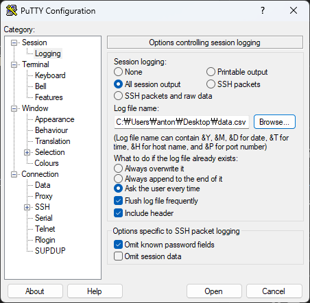
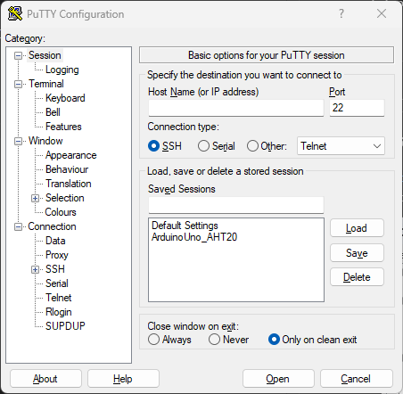
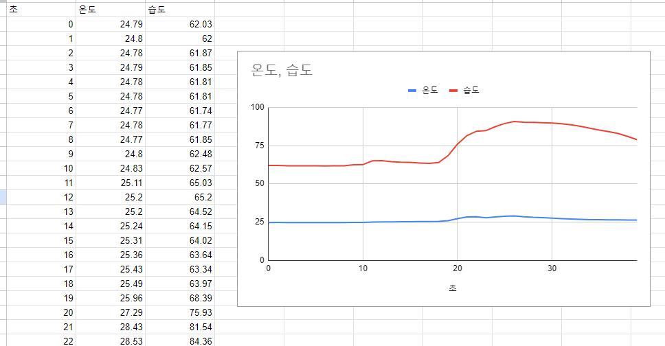

# putty 로 데이터 저장하기 

1. [Putty 다운로드하기](https://www.chiark.greenend.org.uk/~sgtatham/putty/latest.html) 
2. Putty에서 시리얼 통신을 연결하기 
- 
- Sessing logging -> All session output
- Log file name : 원하는 경로에 data.csv 파일로 지정한다.
- Session -> Serial -> Serial line : COM 포트 번호
- Saved Sessions : 저장하기
- 
7. data.csv파일을 엑셀(또는 구글 스프레드 시트)에서 가져오기 
8. 데이터를 차트로 만들기

